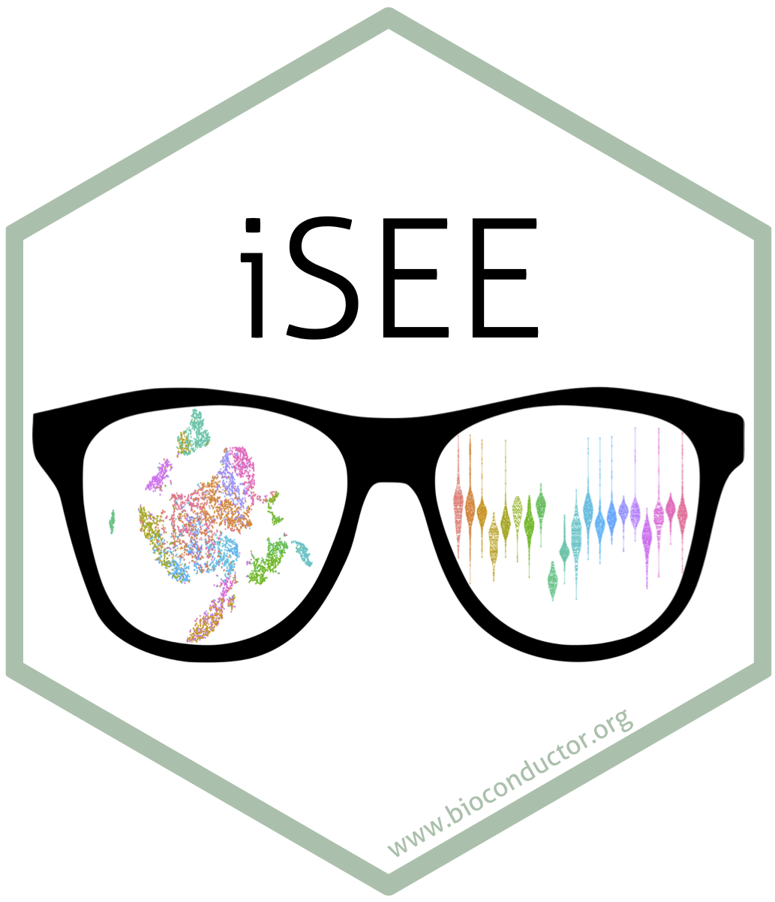
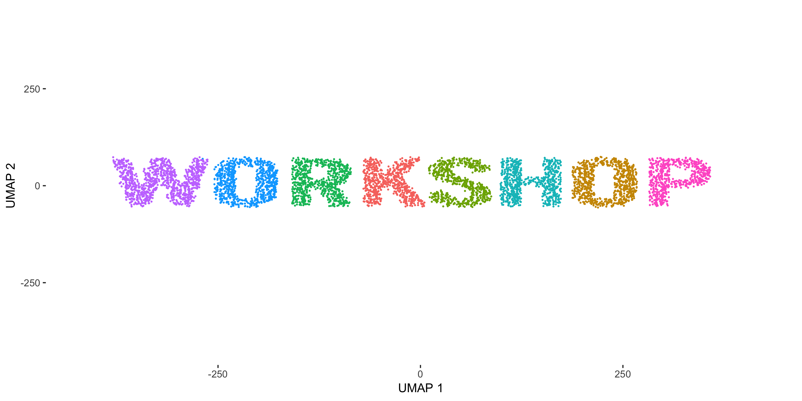

layout: true

<div class="my-header"></div>

<div class="my-footer"><span>
iSEE Workshop 2020
&emsp;&emsp;&emsp;&emsp;&emsp;&emsp;&emsp;&emsp;
interactive SummarizedExperiment Explorer
</span></div>

```{r setup, include=FALSE}
stopifnot(require(iSEE))
stopifnot(require(htmltools))
stopifnot(require(RefManageR))
stopifnot(require(knitr))
```

```{r htmltools, include=FALSE}
stopifnot(requireNamespace("htmltools"))
htmltools::tagList(rmarkdown::html_dependency_font_awesome())
```

```{r, load_refs, include=FALSE, cache=FALSE}
options(htmltools.dir.version = FALSE)
BibOptions(
  check.entries = FALSE,
  bib.style = "authoryear",
  cite.style = "authoryear",
  max.names = 2,
  style = "markdown",
  hyperlink = "to.doc",
  dashed = TRUE)
bib <- ReadBib("references.bib")
```

---

# Structure of the session

.pull-left[
## Timeline

<i class="far fa-clock"></i>
This session is 90 minutes.

- Introduction slides

- Cloud workshop setup

- Introduction to the GUI

- Interactive exercises
]

.pull-right[
## Interact

<i class="fab fa-slack"></i> Slack [#isee](https://community-bioc.slack.com/archives/C8BJLSP8T)

<i class="fab fa-github-square"></i> Slides [GitHub Pages](https://isee.github.io/iSEEWorkshopEuroBioc2020Slides/#1)

<i class="fab fa-github-square"></i> Workshop vignette [GitHub Pages](https://isee.github.io/iSEEWorkshopEuroBioc2020)


<i class="fab fa-github"></i>
GitHub [organization](https://github.com/iSEE).
]

---

# <i class="fas fa-users"></i> The team

<br/>

<table>
<tr>
<td width="25%"><a href="https://kevinrue.github.io"></a></td>
<td width="25%"><a href="https://csoneson.github.io"></a></td>
<td width="25%"><a href="https://federicomarini.github.io"></a></td>
<td width="25%"><a href="https://orcid.org/0000-0002-3564-4813"></a></td>
</tr>
<tr>
<td align='center' width="25%">Kevin</td>
<td align='center' width="25%">Charlotte</td>
<td align='center' width="25%">Federico</td>
<td align='center' width="25%">Aaron</td>
</tr>
</table>

```{r, include=FALSE}
NoCite(bib, "rue2018isee")
```

???

This was a team effort!

---

# <i class="fas fa-pencil-ruler"></i> Designed for Bioconductor

```{r, fig.align='center', out.width='75%',  echo=FALSE}
knitr::include_graphics("img/stickers/biocstickers.jpg")
```

<https://bioconductor.org>

???

iSEE tightly integrates with other packages of the Bioconductor project.

---

# SingleCellExperiment

```{r, fig.align='center', out.height='400px', echo=FALSE}
knitr::include_graphics("img/OSCA/bioc-figures_v2-02.png")
```

.footnote[
`r Citet(bib, "amezquita2020osca")`
]

???

iSEE focuses on the SingleCellExperiment class.
This class stores all the data and metadata associated with assays, cells, and features.

---

# SingleCellExperiment usage in a workflow

.pull-left[
- Data import (`DropletUtils`, `tximeta`)

- Quality control (`scater`)

- Normalization, feature selection (`scran`, `zinbwave`)

- Dimensionality reduction (`BiocSingular`, `scater`, `zinbwave`)

- Clustering (`SC3`, `clustree`)

- Marker gene detection (`scran`, `scDD`)

- Trajectory inference (`slingshot`)

- Visualization (`iSEE`)

- And much more...
]

.pull-right[
```{r, fig.align='center', echo=FALSE}
knitr::include_graphics("img/OSCA/bioc-figures_v2-03.png")
```

.right[
`r Citet(bib, "amezquita2020osca")`
]
]

???

The SingleCellExperiment class is designed to accomodate all the information produced along a typical single-cell analysis workflow.

Those data include raw data:

- raw assay data
- experimental metadata
Processed data:
- quality control metrics
- normalized data
- dimensionality reduction results
Downstream analyses:
- cluster labels
- differential expression results
- downstream cell and feature annotations

---

# iSEE <i class="fas fa-heartbeat"></i> SingleCellExperiment

```{r, fig.align='center', out.width='60%', echo=FALSE}
knitr::include_graphics("img/OSCA/OSCA-figure-4.png")
```

.footnote[
`r Citet(bib, "amezquita2020osca")`
]

???

Here we demonstrate how iSEE dissects SCE objects to produce figures.

---

# The iSEE interface

```{r, fig.align='center', out.width='100%', echo=FALSE}
knitr::include_graphics("img/screenshots/iSEE_screenshot.png")
#knitr::include_graphics("https://raw.githubusercontent.com/kevinrue/iSEEWorkshop2019/master/inst/vignettes/img/iSEEinterface.png")
```

???

iSEE provides a powerful yet flexible user interface that includes 8 predefined panel types.
That said, it also gives the freedom to define any number custom panel types, both plots and tables.

---

# <i class="fas fa-laptop"></i> Workshop

```{r, fig.align='center', echo=FALSE, out.height='300px', out.width='600px'}

```

## Resources

- [Interface overview](https://isee.github.io/iSEEWorkshopEuroBioc2020/articles/overview.html),
  or `vignette('overview', 'iSEEWorkshopEuroBioc2020')`

- [Exercises](https://isee.github.io/iSEEWorkshopEuroBioc2020/articles/exercises.html),
  or, `vignette('exercises', 'iSEEWorkshopEuroBioc2020')`

???

With that introduction to the user interface, let us head into the workshop!

Generated by: <i class="fab fa-github"></i> [kevinrue/magick-profile](https://github.com/kevinrue/magick-profile)

